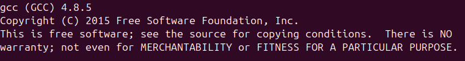
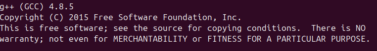

# How to Compile GCC-4.8.5 on Ubuntu 24.04

此教程有中文版直接搜索 __如何在Ubuntu24.04下编译GCC-4.8.5__ 即可

Compiling GCC-4.8.5, or GCC-4.x.x, was done in order to compile JDK 1.8. During the process, many errors occurred, and I referred to numerous tutorials. I am very grateful for the assistance. https://stackoverflow.com/questions/78777082/how-to-build-and-install-compiler-g-4-8-5-on-ubuntu-24-04-from-source-code

## 1 Install a usable version of GCC.

Since compiling GCC requires an existing version of GCC, and the default GCC provided by Ubuntu is version 13, you can use GCC 13 by installing it directly via apt.
```bash
sudo apt update
sudo apt upgrade
sudo apt install build-essential
```

## 2 Download the necessary dependencies.


Simply enter the commands as follows.

```bash
sudo apt install build-essential libgmp-dev libmpfr-dev libmpc-dev texinfo wget

sudo apt install make wget git gcc g++ lhasa libgmp-dev libmpfr-dev libmpc-dev flex bison gettext texinfo ncurses-dev autoconf rsync
sudo apt-get install binutils
sudo dnf install isl-devel
```

## 3 Download the GCC-4.8.5 source code and extract it.
The following steps depend on the current directory. In this case, the directory used is `/mnt`. After switching to the `/mnt` directory, you can execute the commands directly.

```bash
wget http://ftp.gnu.org/gnu/gcc/gcc-4.8.5/gcc-4.8.5.tar.gz
tar -xzvf gcc-4.8.5.tar.gz
cd gcc-4.8.5
```

## 4 Modify some of the source code.
1.Since the latest C++ standard (C++20) conflicts with the older GCC source code, you need to modify some parts of the GCC-4.8.5 source code. Simply follow the commands below.

```bash
sudo vim gcc/reload1.c 
```

Enter the reload1.c file, search for `"spill_indirect_levels++"`, and replace it with `"spill_indirect_levels = 1"`. Finally, save and exit using the `:wq` command.

2.Commenting out `__attribute__`can prevent compilation errors. In the `libgcc/config/i386/linux-unwind.h` file, replace all instances of struct ucontext with ucontext_t. In the `libsanitizer/asan/asan_linux.cc` file, locate the line `#include <pthread.h>` and insert `#include <signal.h>` after it. You can directly execute the following commands.
```bash
sed -i -e 's/__attribute__/\/\/__attribute__/g' gcc/cp/cfns.h
sed -i 's/struct ucontext/ucontext_t/g' libgcc/config/i386/linux-unwind.h
sed -i '/#include <pthread.h>/a #include <signal.h>' libsanitizer/asan/asan_linux.cc

```

3.Open the `tsan_platform_linux.cc` file, search for `statp`, and replace the line below statp `__res_state *statp = ( __res_state*)state;`

with:

`struct __res_state *statp = (struct __res_state*)state;`

Then, save and exit.
```bash
sudo vim libsanitizer/tsan/tsan_platform_linux.cc 
```

4.In the `libitm/config/linux/rwlock.cc` file, replace all instances of `typeof` with `__typeof__`. Then, save and exit.
```bash
sudo vim  libitm/config/linux/rwlock.cc 
```

## 5 Preparation Before Compilation


Simply execute the following commands.

```bash
mkdir build
cd build
```

## 6 Configure the build configuration options.

Simply execute the following command, making sure to pay attention to the path. The `--prefix` option is the target installation path.

```bash
sudo ../configure --prefix=/mnt/gcc/gcc-4.8.5
--enable-threads=posix                    
--disable-checking                    
--disable-multilib                    
--enable-languages=c,c++                    
--disable-libsanitizer                    
--disable-nls
```

## 7 Compilation and Installation

Execute the compilation command and install it to the path specified in the `--prefix` option.

```bash
sudo make -V
sudo make install
```

After completing the installation, you can find the installed GCC 4.8.5 in the `/mnt/gcc/gcc-4.8.5` directory.

## 8 Set the current system's GCC to GCC 4.8.5

1.Configure the priority for GCC 4.8.5 and G++ 4.8.5. Simply execute the following commands.
```bash
sudo update-alternatives --install /usr/bin/gcc gcc /mnt/gcc/gcc-4.8.5/bin/gcc 100
sudo update-alternatives --install /usr/bin/g++ g++ /mnt/gcc/gcc-4.8.5/bin/g++ 100
```

2.Modify the system's GCC and G++ versions. Simply enter the following command.
```bash
sudo update-alternatives --config gcc
sudo update-alternatives --config g++
```


Select the number for GCC 4.8.5 (here it is 1), and do the same for G++ 4.8.5.

3.Check if the modification was successful.

```bash
gcc --version
g++ --version
```



Installation completed.

