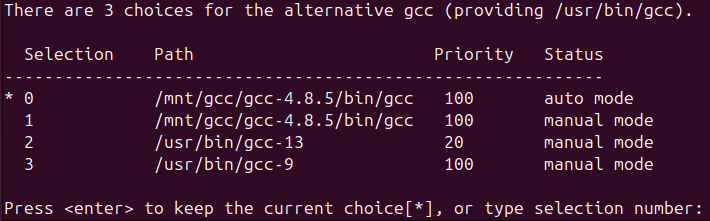
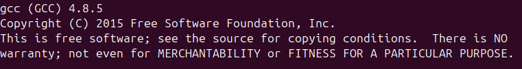

# 如何在Ubuntu24.04下编译GCC-4.8.5

This tutorial has an English version. Simply search for __"How to Compile GCC-4.8.5 on Ubuntu 24.04"__.

编译GCC-4.8.5或者说GCC-4.x.x是为了编译jdk1.8，期间踩了很多坑，参考了很多教程。在此非常感谢Stack overFlow https://stackoverflow.com/questions/78777082/how-to-build-and-install-compiler-g-4-8-5-on-ubuntu-24-04-from-source-code

## 1安装一个可以使用的GCC版本

因为编译GCC需要一个现有的GCC来编译，Ubuntu提供的GCC默认就是13所以采用GCC13，直接使用apt安装即可

```bash
sudo apt update
sudo apt upgrade
sudo apt install build-essential
```

## 2 下载一些必要的依赖

直接按照输入命令即可

```bash
sudo apt install build-essential libgmp-dev libmpfr-dev libmpc-dev texinfo wget

sudo apt install make wget git gcc g++ lhasa libgmp-dev libmpfr-dev libmpc-dev flex bison gettext texinfo ncurses-dev autoconf rsync
sudo apt-get install binutils
sudo dnf install isl-devel
```

## 3下载GCC-4.8.5源码并解压

接下里的部分操作和当前目录有关系这里使用的目录是`/mnt`，切换到`/mnt`目录后，直接执行命令即可

```bash
wget http://ftp.gnu.org/gnu/gcc/gcc-4.8.5/gcc-4.8.5.tar.gz
tar -xzvf gcc-4.8.5.tar.gz
cd gcc-4.8.5
```

## 4修改部分源码

1.由于当前最新的C++标准C++（20）与旧版本GCC源码会发生冲突，所以需要修改部分GCC-4.8.5的源码，还是按照下面的命令操作即可

```bash
sudo vim gcc/reload1.c 
```

进入到reload1.c 文件后搜索"spill_indirect_levels++"，并将"spill_indirect_levels++"替换为"spill_indirect_levels = 1" ，最后使用：wq命令保存并退出。

2.注释 `__attribute__ `可以避免编译错误,在 `libgcc/config/i386/linux-unwind.h` 文件中，将所有 `struct ucontext` 替换为 `ucontext_t`,在 `libsanitizer/asan/asan_linux.cc` 文件中，找到 `#include <pthread.h>` 的那一行，在其后面插入 `#include <signal.h>`。直接执行下面命令即可

```bash
sed -i -e 's/__attribute__/\/\/__attribute__/g' gcc/cp/cfns.h
sed -i 's/struct ucontext/ucontext_t/g' libgcc/config/i386/linux-unwind.h
sed -i '/#include <pthread.h>/a #include <signal.h>' libsanitizer/asan/asan_linux.cc

```

3.打开tsan_platform_linux.cc文件，搜索statp，把statp下面一行的`__res_state *statp = ( __res_state*)state;`替换成`struct __res_state *statp = (struct __res_state*)state;"`.保存并退出

```bash
sudo vim libsanitizer/tsan/tsan_platform_linux.cc 
```

4.替换`libitm/config/linux/rwlock.cc`文件中的内容，将"typeof"全部替换为 `"__typeof__"`.保存并退出

```bash
sudo vim  libitm/config/linux/rwlock.cc 
```

## 5编译前准备

直接执行下面命令即可

```bash
mkdir build
cd build
```

## 6配置编译配置项

直接执行下面命令即可，注意路径，`--prefix`配置项为目标路径

```bash
sudo ../configure --prefix=/mnt/gcc/gcc-4.8.5
--enable-threads=posix                    
--disable-checking                    
--disable-multilib                    
--enable-languages=c,c++                    
--disable-libsanitizer                    
--disable-nls
```

## 7编译以及安装

执行编译命令并安装到上面配置项`-prefix`路径

```bash
sudo make -V
sudo make install
```

执行完毕后即可在`/mnt/gcc/gcc-4.8.5`中查看到安装完的GCC4.8.5

## 8是当前系统的使用的GCC为GCC4.8.5

1为GCC4.8.5和G++4.8.5配置权重，直接执行下面的命令即可

```bash
sudo update-alternatives --install /usr/bin/gcc gcc /mnt/gcc/gcc-4.8.5/bin/gcc 100
sudo update-alternatives --install /usr/bin/g++ g++ /mnt/gcc/gcc-4.8.5/bin/g++ 100
```

2修改系统的GCC和G++版本，直接输入

```bash
sudo update-alternatives --config gcc
sudo update-alternatives --config g++
```



选择GCC4.8.5的编号（这里是1），G++4.8.5也是同样的操作

3查看是否修改成功

```bash
gcc --version
g++ --version
```




安装完成

